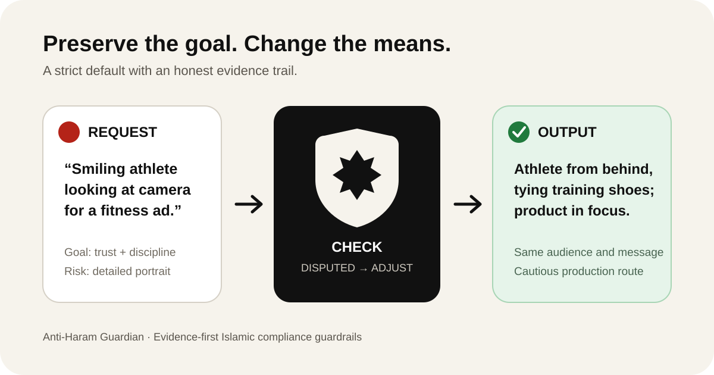

<div align="center">
  
  <h1>Anti-Haram Guardian</h1>
  <p><strong>Evidence-first Islamic guardrails that preserve the user's goal.</strong></p>
  <p>
    <a href="LICENSE"></a>
    <a href="skills/anti-haram-guardian/SKILL.md"></a>
    <a href=".github/workflows/validate.yml"></a>
  </p>
</div>

Anti-Haram Guardian is a portable Agent Skill for screening creative, commercial, technical, and communication work. It detects a specific concern, checks the evidence level, and completes the underlying goal through a cautious lawful route whenever possible.

It is deliberately strict in production while honest about uncertainty: direct scripture stays distinct from scholarly application, disputed modern cases are labeled, and missing evidence never becomes a made-up ruling.



## Why it is different

- **Evidence before verdicts** — Qur'an, authentic Sunnah, then attributed scholarly application.
- **Goal-preserving intervention** — adjusts the risky means instead of abandoning the useful outcome.
- **Disagreement-aware** — never turns a cautious default into a fake consensus.
- **Production-ready** — covers image prompts, video concepts, audio briefs, voice use, captions, ads, commerce, and advice.
- **Quiet on clean tasks** — no warning banner or sermon when nothing relevant is detected.
- **Auditable** — a CSV source registry and validator make citations maintainable.

## The decision engine

| Evidence state | Meaning | Default action |
|---|---|---|
| `CLEAR` | Direct evidence; straightforward application | Adjust or decline the specific element |
| `ESTABLISHED` | Reputable scholarly application | Attribute it and use the cautious route |
| `DISPUTED` | Recognized disagreement exists | Name the disagreement; apply strict default |
| `UNKNOWN` | Facts or support are insufficient | Do not rule; research or refer |

Every request ends in one of five actions: `PASS`, `ADJUST`, `PAUSE`, `DECLINE`, or `REFER`.

## Install

Clone the repository:

```bash
git clone https://github.com/Tulip9ZZZA/anti-haram-guardian.git
```

The installable skill is the directory at [`skills/anti-haram-guardian`](skills/anti-haram-guardian). Copy that complete directory into the skills location used by your agent runtime. For Codex installations that use the default personal-skills directory:

```bash
cp -R anti-haram-guardian/skills/anti-haram-guardian ~/.codex/skills/anti-haram-guardian
```

Restart or refresh the agent so it discovers the new skill.

## Use

Invoke it explicitly:

```text
Use $anti-haram-guardian to turn this portrait-led fitness ad into a cautious compliant concept without losing conversion power.
```

```text
Use $anti-haram-guardian to audit this Instagram caption for false scarcity, unsupported religious claims, and manipulative wording, then rewrite it.
```

```text
Use $anti-haram-guardian to replace the music in this 30-second launch video with a usable natural-sound cue sheet.
```

```text
Use $anti-haram-guardian to identify the questions a qualified scholar would need before reviewing this dropshipping arrangement.
```

## Before → after

### Image prompt

**Before**

> Close portrait of a smiling athlete promoting a protein brand.

**After**

> Editorial sports campaign, athlete viewed completely from behind while tying training shoes beside a gym bench, face not visible, focus on hands, product pouch, and disciplined preparation, strong directional light, charcoal and warm sand palette, clean premium composition, negative space for headline.

Negative prompt: `visible face, eyes, nose, mouth, facial expression, portrait close-up`

### Caption

**Before**

> Only 4 seats left—price doubles tonight! Everyone gets results.

**After**

> Build a practical content system you can use this week. The workshop includes two live sessions, the planning workbook, and 30 days of replay access. Enrollment closes Friday at 18:00 UTC so we can prepare the cohort. Review the curriculum and terms before you join.

The rewrite keeps urgency only when the deadline is real and removes the unverifiable guarantee.

More complete examples:

- [Visual prompt transformation](examples/image-prompt.md)
- [Caption and advice rewrite](examples/caption-rewrite.md)
- [Music-free audio brief](examples/audio-brief.md)
- [Commerce review handoff](examples/commerce-review.md)

## Architecture

```text
anti-haram-guardian/
├── assets/                         # Public logo and example visual
├── examples/                       # Ready-to-copy use cases
└── skills/anti-haram-guardian/
    ├── SKILL.md                    # Core routing and decision engine
    ├── agents/openai.yaml          # Agent UI metadata
    ├── assets/                     # Skill icons
    ├── references/
    │   ├── source-policy.md        # Citation and disagreement rules
    │   ├── sources.csv             # Verified evidence registry
    │   ├── visual-media.md         # Images and video
    │   ├── audio-media.md          # Music, sound, and voice
    │   ├── commerce-and-copy.md    # Captions, advice, finance, mechanics
    │   ├── sacred-content.md       # Protected personalities
    │   └── response-patterns.md    # Compact output templates
    └── scripts/validate_sources.py # Zero-dependency source validator
```

The main `SKILL.md` stays lean and loads only the reference needed for the task.

## Validate

```bash
python3 scripts/validate_repo.py
python3 skills/anti-haram-guardian/scripts/validate_sources.py \
  skills/anti-haram-guardian/references/sources.csv
```

The GitHub workflow runs both checks on every push and pull request.

## Scope and boundaries

This project is an operational guardrail, not a mufti and not a replacement for qualified scholarship. It does not certify financial products, issue personalized fatwas, or invent unanimity on disputed contemporary media. Its strict defaults are designed to make cautious output practical while keeping the evidence trail honest.

## Contributing

Evidence corrections, safer alternatives, and new worked examples are welcome. Read [CONTRIBUTING.md](CONTRIBUTING.md) before opening a pull request. Every new religious claim must include a stable source and an explicit evidence type.

## License

Released under the [MIT License](LICENSE).
